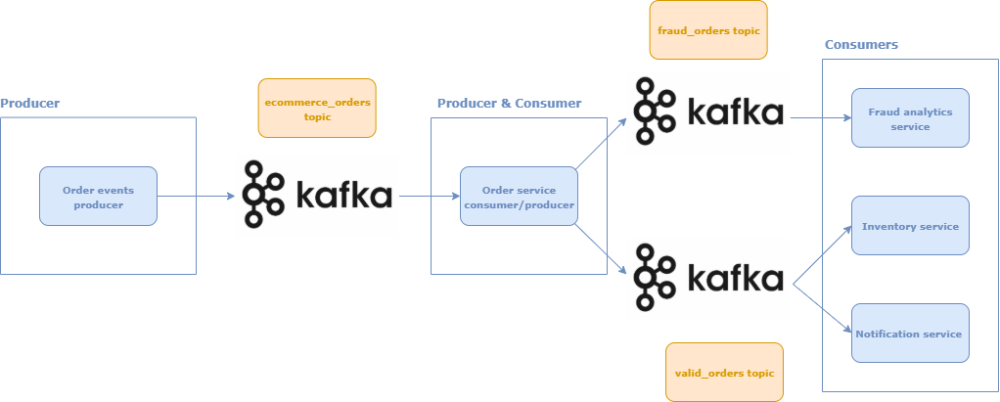

# Use case: Event-driven order processing for an e-commerce platform using Kafka

## Overview




- Order events producer – Simulates e-commerce order events.
- Order service consumer/producer – Detects suspicious order events and processes valid incoming orders.
- Fraud analytics service – Simulates fraud alerts.
- Inventory service – Simulates update of product inventory based on valid processed orders. 
- Notification service – Simulates send of notifications based on the events.


## How to start services


### 1. Start Kafka and Zookeeper Cluster

```bash ./scripts/run-cluster.sh```

### 2. Start Order events producer

```bash ./scripts/produce-orders.sh```


### 3. Start Order service consumer/producer

```bash ./scripts/consume-orders.sh```

### 4. Start Fraud analytics service

```bash ./scripts/fraud-analytics-service.sh```


### 5. Start Inventory service

```bash ./scripts/inventory-service.sh```


### 6. Start Notification service

```bash ./scripts/notification-service.sh```

## Monitor logs of the services

```docker logs -f <container_name>```
